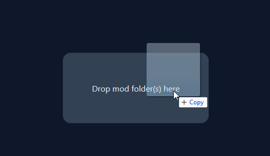
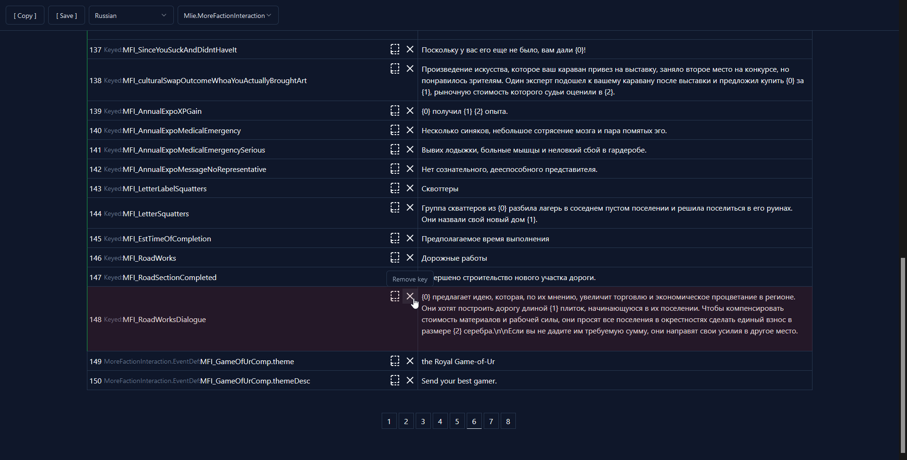

[T3 web app](https://create.t3.gg) to help with translation of Rimworld mods.

Plan was to create system where people can request mod's translation to certain language, translate some of it (or just upload untranslated key/value pairs) and for other people to translate other parts, improve translations, etc.

Currently you can only upload mod and it will automatically find all lines of text that need to be translated and package it in format that Rimworld understands.
Key/value pairs can be translated through site's interface with easy access to orignal text. Translation can be downloaded and added to Rimworld as a mod.

[Vercel demo](https://mod-translations.vercel.app/)

To load mod simply drag and drop mod's folder.

Preview of translation of [More faction interaction](https://github.com/emipa606/MoreFactionInteraction) mod.
Some keys are already translated, some aren't.

